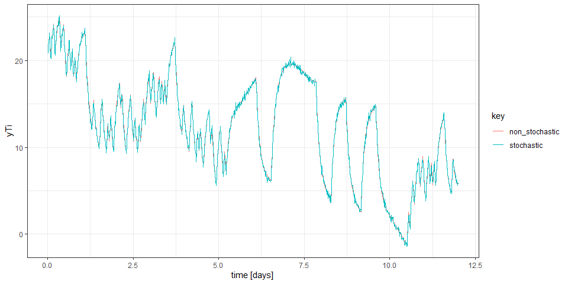
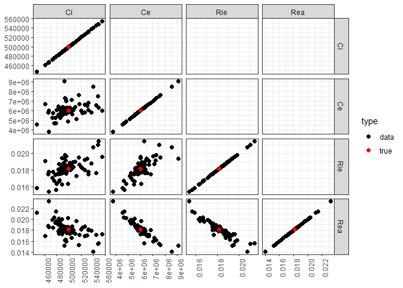
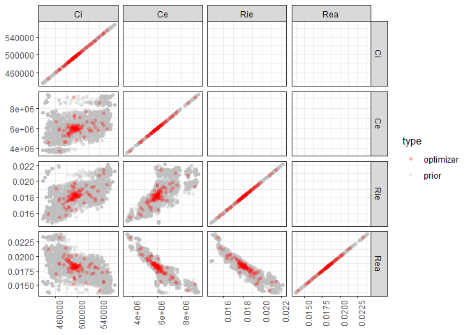
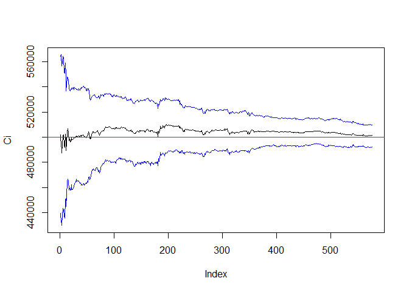
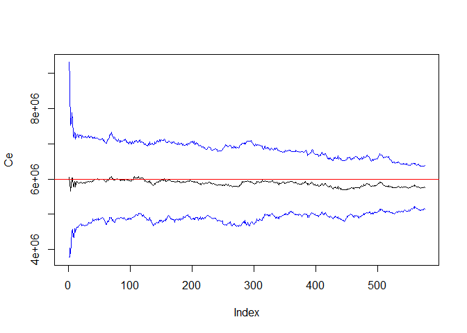
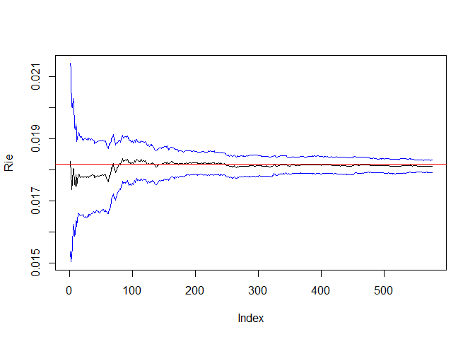
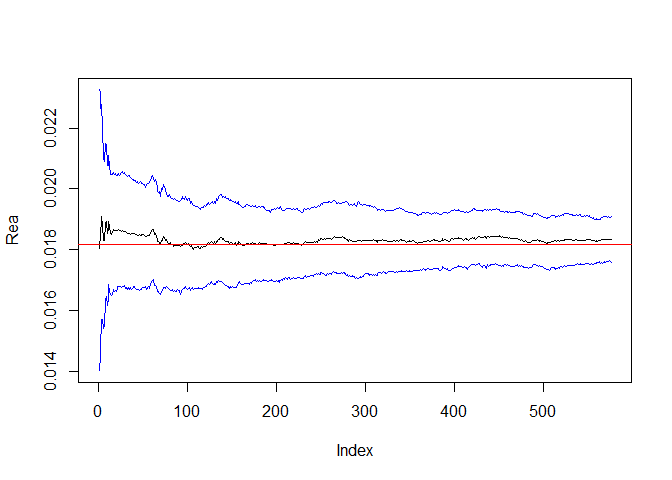

-   [1. Introduction](#introduction)
-   [2. Model description](#model-description)
    -   [2.1 A simple grey-box model with two
        states.](#a-simple-grey-box-model-with-two-states.)
    -   [2.2 Governing differential
        equations](#governing-differential-equations)
    -   [2.3 System equations in a probablistic
        format](#system-equations-in-a-probablistic-format)
-   [3. Synthetic Data](#synthetic-data)
    -   [3.1 True parameter](#true-parameter)
    -   [3.2 Read input data and generate synthetic
        data](#read-input-data-and-generate-synthetic-data)
-   [4. Create priors](#create-priors)
    -   [4.1 Upper and lower bounds of states and
        parameter](#upper-and-lower-bounds-of-states-and-parameter)
    -   [4.2 Optimization to get set of parameters
        (Eq. 14)](#optimization-to-get-set-of-parameters-eq.-14)
    -   [4.3 Visualize obtained set of
        parameters](#visualize-obtained-set-of-parameters)
    -   [4.4 Kernel density approximation of set of
        pameters](#kernel-density-approximation-of-set-of-pameters)
    -   [4. Kernel density approximation of set of
        pameters](#kernel-density-approximation-of-set-of-pameters-1)
-   [5. Liu-West filter](#liu-west-filter)

1. Introduction
===============

This is accompanies code of *Appendix C* in paper
[“xxx”](https://dx.doi.org/). This is a simple demonstaration of
Liu-West filter for a simple building grey-box model. We generated a
synthetic data and applied Liu-West filter to see if the filter can be
applicable for this problem. All code is written in `R` language. The
main purpose of this document is to provide reproducible example.

The pacakge depedency of this code is managed by `renv` package. You can
look at `renv.lock` file to see the required package. However, for the
simplicity, just run following script on this rproject.

After clone the repository and run `building_lw_filter.Rproj` file (you
must have [Rstudio](https://rstudio.com/products/rstudio/)) with
[`R>3.5.3`](https://www.r-project.org/).

    git clone https://github.com/ecosang/building_lw_filter.git

In R console, run following script.

``` r
# Run this code in Rstudio
install.packages('renv',repos="https://cran.rstudio.com")
renv::equip() #install required software
renv::restore()
```

Technically, this installs all required packages, and you can reproduce
all codes below. However, if this doesn’t work, please report
[issues](https://github.com/ecosang/building_lw_filter/issues).

All functions used in this code is in `code/utility.R`. Also, all
generated data and trained model are stored in `data` folder.

2. Model description
====================

2.1 A simple grey-box model with two states.
--------------------------------------------

The grey-model is composed of two states. Below figure shows R-C circuit
diagram of this model. All variables are listed below.

*Variables*

-   *x*<sub>i</sub>: indoor temperature state \[**<sup>∘</sup>C\]
-   *x*<sub>e</sub>: envelope temperature state \[**<sup>∘</sup>C\]
-   *T*<sub>a</sub>: outdoor air temperature \[**<sup>∘</sup>C\]
-   *y*<sub>*x*<sub>i</sub>, *t*<sub>*k*</sub></sub>: measured
    temperature of state *x*<sub>i</sub> \[**<sup>∘</sup>C\]
-   *R*<sub>ie</sub>: thermal resistance between *x*<sub>i</sub> and
    *x*<sub>e</sub> \[K/W\]
-   *R*<sub>ea</sub>: thermal resistance between *x*<sub>e</sub> and
    *T*<sub>a</sub> \[K/W\]
-   *C*<sub>e</sub>: thermal capacitance of *x*<sub>e</sub> \[J/K\]
-   *C*<sub>i</sub>: thermal capacitance of *x*<sub>i</sub> \[J/K\]
-   *Q̇*<sub>hc</sub>: heating or cooling flow rate \[W\]
-   *t* and *t*<sub>*k*</sub> are time in seconds and its discretized
    time, respectively.
-   *d**ω*/*d**t* is standard weiner process.
-   *σ*<sub>i</sub><sup>2</sup> and *σ*<sub>e</sub><sup>2</sup> are
    process noise variance of states *x*<sub>i</sub> and
    *x*<sub>e</sub>, repsectively.
-   *σ*<sub>d,y</sub><sup>2</sup> is observational noise variance of
    measurement *y*.

2.2 Governing differential equations
------------------------------------

The thermal dynamics are expressed with below system of differntial
equations. Here, *R* is thermal resistance and *C* is thermal
capacitance.

$$\\frac{ dx\_{\\text{i}} }{dt} =\\left( \\frac{1}{R\_{\\text{ie}} C\_{\\text{i}}}(x\_\\text{e}-x\_\\text{i}) +\\frac{1}{C\_{\\text{i}}} \\dot{Q}\_{\\text{hc}} \\right)+\\sigma\_i \\frac{d\\omega}{dt}$$

$$\\frac{dx\_{\\text{e}}}{dt}=\\left( \\frac{1}{R\_{\\text{ie}} C\_{\\text{e}}}(x\_\\text{i}-x\_\\text{e})+ \\frac{1}{R\_{\\text{ea}} C\_{\\text{e}}}+(T\_{\\text{out}}-x\_\\text{e})  \\right)+\\sigma\_e \\frac{d\\omega}{dt}$$

*y*<sub>*x*<sub>i</sub>, *t*<sub>*k*</sub></sub> = *x*<sub>i, *t*<sub>*k*</sub></sub> + *ε*<sub>*y*, *t*<sub>*k*</sub></sub> where  *ε*<sub>*y*, *t*<sub>*k*</sub></sub> ∼ 𝒩(0, *σ*<sub>d, *y*</sub>)

2.3 System equations in a probablistic format
---------------------------------------------

The system of matrix can be expressed in matrix form.

$$\\begin{bmatrix} 
\\dot{x}\_{\\text{i},t}  \\\\ 
\\dot{x}\_{\\text{e},t}  
\\end{bmatrix}=
\\underbrace{
\\begin{bmatrix} 
-\\frac{1}{R\_\\text{ie}C\_\\text{i}} & \\frac{1}{R\_\\text{ie}C\_\\text{i}}  \\\\ 
\\frac{1}{R\_\\text{ie}C\_\\text{e}} & -\\frac{1}{R\_\\text{ie}C\_\\text{e}}-\\frac{1}{R\_\\text{ea}C\_\\text{e}}  
\\end{bmatrix} }\_{\\textbf{A}}
\\begin{bmatrix} 
x\_{\\text{i},t}  \\\\ 
x\_{\\text{e},t}     
\\end{bmatrix} +
\\underbrace{\\begin{bmatrix} 
0 & \\frac{1}{C\_\\text{i}}  \\\\ 
\\frac{1}{R\_\\text{ea}C\_\\text{e}} & 0  
\\end{bmatrix} }\_{\\textbf{B}}
\\begin{bmatrix} 
T\_{\\text{out},t}  \\\\ 
\\dot{Q}\_{\\text{hc},t}   
\\end{bmatrix}+
\\begin{bmatrix} 
\\sigma\_{i}\\dot{\\boldsymbol{\\omega}}\_{t}  \\\\ 
\\sigma\_{e}\\dot{\\boldsymbol{\\omega}}\_{t}   
\\end{bmatrix}$$

$$
y\_{x\_\\text{i},t\_k}=\\underbrace{\\begin{bmatrix}1&0\\end{bmatrix}}\_{\\textbf{C}}\\begin{bmatrix}x\_{\\text{i},t\_k}\\\\x\_{\\text{e},t\_k}\\end{bmatrix}+\\varepsilon\_{y,t\_k}
$$

Since this system is a linear gaussian model, it can be discretized
without integration (see Appendix B of paper) (or this
[link](https://github.com/ecosang/misc/blob/master/discretization.pdf)).
Here, subscript **<sub>*d*</sub> indicates discretization.
**x**<sub>*t*<sub>*k*</sub></sub> = \[*x*<sub>i, *t*<sub>*k*</sub></sub>, *x*<sub>e, *t*<sub>*k*</sub></sub>\]<sup>⊺</sup>,
**u**<sub>*t*<sub>*k*</sub></sub> = \[*T*<sub>a</sub>,*Q̇*<sub>hc</sub>\]<sup>⊺</sup>,
and
**θ** = {*R*<sub>ie</sub>, *R*<sub>ea</sub>, *C*<sub>e</sub>, *C*<sub>i</sub>, *σ*<sub>i</sub>, *σ*<sub>e</sub>}

*P*(**x**<sub>*t*<sub>*k*</sub> + 1</sub>\|**x**<sub>*t*<sub>*k*</sub></sub>) = 𝒩(**x**<sub>*t*<sub>*k*</sub> + 1</sub>\|*f*<sub>*d*</sub>(**x**<sub>*t*<sub>*k*</sub></sub>,**u**<sub>*t*<sub>*k*</sub></sub>,**θ**), **σ**<sub>d, *x*</sub>)

*P*(*y*<sub>*x*<sub>i</sub>, *t*<sub>*k*</sub></sub>\|**x**<sub>*t*<sub>*k*</sub></sub>) = 𝒩(*y*<sub>*x*<sub>i</sub>, *t*<sub>*k*</sub></sub>\|*g*<sub>*d*</sub>(**x**<sub>*t*<sub>*k*</sub></sub>,**u**<sub>*t*<sub>*k*</sub></sub>,**θ**), *σ*<sub>d, *y*</sub>)

*f*<sub>*d*</sub>(**x**<sub>*t*<sub>*k*</sub></sub>,**u**<sub>*t*<sub>*k*</sub></sub>,**θ**) = **A**<sub>d</sub>**x**<sub>*t*<sub>*k*</sub></sub> + **B**<sub>d</sub>**u**<sub>*t*<sub>*k*</sub></sub>  and  *g*<sub>*d*</sub>(**x**<sub>*t*<sub>*k*</sub></sub>,**θ**) = **C**<sub>d</sub>**x**<sub>*t*<sub>*k*</sub></sub>
where **A**<sub>d</sub>, **B**<sub>d</sub>, and **C**<sub>d</sub> are
discretized parameters of **A**, **B**, and **C** matrix given above.

3. Synthetic Data
=================

3.1 True parameter
------------------

Based on the above model, we assigned true parameter values to generate
synthetica data. From the synthetic data, we apply Liu-West filter, and
the final posterior distribution of parameters will be compared to those
true parameter values.

<table>
<colgroup>
<col style="width: 12%" />
<col style="width: 12%" />
<col style="width: 12%" />
<col style="width: 18%" />
<col style="width: 21%" />
<col style="width: 12%" />
<col style="width: 12%" />
</colgroup>
<thead>
<tr class="header">
<th></th>
<th><span class="math inline"><em>T</em><sub>i, 0</sub></span></th>
<th><span class="math inline"><em>T</em><sub>e, 0</sub></span></th>
<th><span class="math inline"><em>C</em><sub>i</sub></span></th>
<th><span class="math inline"><em>C</em><sub>e</sub></span></th>
<th><span class="math inline"><em>R</em><sub>ie</sub></span></th>
<th><span class="math inline"><em>R</em><sub>ea</sub></span></th>
</tr>
</thead>
<tbody>
<tr class="odd">
<td>true</td>
<td>21.0</td>
<td>15.0</td>
<td>500000</td>
<td>6000000</td>
<td>1/55</td>
<td>1/55</td>
</tr>
</tbody>
</table>

To assign, true values, we assume following properties.

-   Total surface are of exterior wall and window are 200m<sup>2</sup>
    and 50m<sup>2</sup>, respectively.
-   U-value of exterior wall and window are 0.2W/m<sup>2</sup>-K and
    1.4W/m<sup>2</sup>-K, respectively.
-   The total R-value is
    $\\frac{1}{UA\_{\\text{ext-wall}}+UA\_{\\text{window}}}=\\frac{1}{110}$.
    Thus, we split 1/110 by 1/55 and 1/55 because only the sum of
    *U**A*<sub>ext-wall</sub> + *U**A*<sub>window</sub> is important.
-   Assuming all envelope mass is concerete. Specific heat
    (*C*<sub>*p*</sub>: 1000 J/kg-K) and density (*ρ*:
    2400 kg/m<sup>3</sup>). Volume with 0.1m thickness:
    250m<sup>2</sup> × 0.1m = 25m<sup>3</sup>.
-   The exterior wall heat capacitance (*C*<sub>e</sub>):
    *C*<sub>*p*</sub> × *ρ* × *V* ≈ 6000000 J/K
-   Assuming air specific heat is 1J/K-m<sup>3</sup> and volume
    1000 m<sup>3</sup>, the indoor heat capacitance (*C*<sub>i</sub>) is
    500000 J/K.

Noise parameters

| *σ*<sub>d, *y*</sub> | *σ*<sub>*x*<sub>*i*</sub></sub> | *σ*<sub>*x*<sub>*e*</sub></sub> |
|----------------------|---------------------------------|---------------------------------|
| 0.25                 | $0.01/\\sqrt{900}$              | $0.01/\\sqrt{900}$              |

Here, *σ*<sub>d, *y*</sub> is set to 0.25 becuase the sensor measurement
accuracy is  ± 0.5<sup>∘</sup>C. Specifically, 𝒩(0, 0.25) generates data
about \[−0.5,0.5\] thinking 95% quantiles.

The continuous process noise *σ*<sub>*i*</sub> and *σ*<sub>*e*</sub> are
set to 0.25/30, respectively. When we discretize the continuous system,
the discretized standard deviation is approximately an order of
$\\sqrt{\\Delta t}$. Therefore, assuming our process noise is 0.25 in a
discrete time-scale, it is approximately $0.01/\\sqrt{\\Delta t}$. Our
dataset has 900s time-scale. Therefore, they are set to
$0.01/\\sqrt{900}$

In the model, we will use fixed value of *σ*<sub>d, *y*</sub> because
the measurement noise value can be obtained from the sensor information.
Actually, this is helpful to stabilize Liu-West filter operation.

3.2 Read input data and generate synthetic data
-----------------------------------------------

Based on input data (**u**<sub>1 : *t*<sub>*K*</sub></sub>), we will
generate synthetic observation data by using a stochastic simulation.

``` r
# load functions
source("code/utility.r")
# load input u data.
dat=readr::read_csv("data/syn_data.csv")
dt=dat$time[2]-dat$time[1] #discrete time
# define all true parameters
x0_true=c(21.0, 15.0) # initial states

#           Ci     Ce        Rie       Rea  #sigma_x_i #sigma_x_e
par_true=c(500000, 6000000,  1/55,     1/55, 0.01/sqrt(dt),      0.01/sqrt(dt) )
dims=c(2,2,1) # dimension of x, u, y, which is [nx, nu, ny]
nx=dims[1] # x dim
nu=dims[2] # u dim
ny=dims[3] # y dim
t_K=dim(dat)[1] #total time time is (1:t_K)

# create u_matrix [nu x t_K], (T_a, Qhc)
u_mat=rbind(t_a=dat$t_a,q_hc=dat$Q_hc) #input u matrix [nu x NT].
# weplit data into two parts to separate prior generation part, filter part.
index_split=ceiling(t_K/2) 
```

Create data synthetic dataset. The data is created once and stored into
`data/synthetic_data.rds` fiel. Then, it is loaded for next time because
we generate the data with random noise from
*σ*<sub>*x*<sub>i</sub></sub>, *σ*<sub>*x*<sub>e</sub></sub>, and
*σ*<sub>d, *y*</sub>. Here the dataset are splitted into two parts. The
first part (`prior_data`) is used to create priors. The second part
(`filter_data`) is used to used particle filtering process.

``` r
## not run this code
# create discretized system matrix
dsys=discretize_system(par=par_true,dims=dims,dt=dt)
# create data set with stochastic process
simulated_data=create_data_set(dsys=dsys,u_mat=u_mat,x0=x0_true,dims=dims,dt=dt,seed_num=1234,stochastic=T)
y_t_i=simulated_data$y_mat[1,] # observation data

# split data by train_data, test_data, all_data
prior_data=list(u_mat=u_mat[,1:index_split],
                y_mat=y_t_i[1:index_split])
filter_data=list(u_mat=u_mat[,(index_split+1):t_K],
                y_mat=y_t_i[(index_split+1):t_K])
all_data=list(u_mat=u_mat,
                y_mat=y_t_i)

# store synthetic data.
write_rds(list(prior_data=prior_data,filter_data=filter_data,all_data=all_data,index_split=index_split),
          paste0("data/synthetic_data.rds"))
```

To see how it looks like, visualize the data with non-stochastic
simulation.

``` r
# load synthetic (stochastically simluated data)
synthetic_data<-readr::read_rds(paste0("data/synthetic_data.rds"))
# load data
prior_data=synthetic_data$prior_data
filter_data=synthetic_data$filter_data
all_data=synthetic_data$all_data
index_split=synthetic_data$index_split

dsys=discretize_system(par=par_true,dims=dims,dt=dt)

non_stochastic_data=create_data_set(dsys=dsys,u_mat=u_mat,x0=x0_true,dims=dims,dt=dt,seed_num=1234,stochastic=F)
```

    ## [1] "non-stochastic"

``` r
# Create dataframe for visualization.
plot_df=tibble(non_stochastic=as.numeric(non_stochastic_data$y_mat),stochastic=as.numeric(synthetic_data$all_data$y_mat))%>%
  mutate(time=row_number()/4/24)

# plot
ggplot(plot_df%>%gather(key,yTi,-time),aes(time,yTi))+geom_line(aes(color=key))+xlab("time [days]")+theme_bw()
```



4. Create priors
================

As described in section 3.4 Model initialization (Prior generation) in
the paper, we created priors to initialize Liu-West filter.

Define parameter lower and upper bounds that create priors.

4.1 Upper and lower bounds of states and parameter
--------------------------------------------------

<table>
<colgroup>
<col style="width: 12%" />
<col style="width: 12%" />
<col style="width: 12%" />
<col style="width: 18%" />
<col style="width: 21%" />
<col style="width: 12%" />
<col style="width: 12%" />
</colgroup>
<thead>
<tr class="header">
<th></th>
<th><span class="math inline"><em>T</em><sub>i, 0</sub></span></th>
<th><span class="math inline"><em>T</em><sub>e, 0</sub></span></th>
<th><span class="math inline"><em>C</em><sub>i</sub></span></th>
<th><span class="math inline"><em>C</em><sub>e</sub></span></th>
<th><span class="math inline"><em>R</em><sub>ie</sub></span></th>
<th><span class="math inline"><em>R</em><sub>ea</sub></span></th>
</tr>
</thead>
<tbody>
<tr class="odd">
<td>true</td>
<td>21.0</td>
<td>15.0</td>
<td>500000</td>
<td>6000000</td>
<td>1/55</td>
<td>1/55</td>
</tr>
<tr class="even">
<td>min</td>
<td>0</td>
<td>0</td>
<td>100000</td>
<td>1000000</td>
<td>1e-9</td>
<td>1e-9</td>
</tr>
<tr class="odd">
<td>max</td>
<td>30.0</td>
<td>30.0</td>
<td>1000000</td>
<td>10000000</td>
<td>0.1</td>
<td>0.1</td>
</tr>
</tbody>
</table>

``` r
# define upper and lower bounds of x0 and theta for prior_data.
max_x_par=c(c(30,30,c(1000000,10000000,.1,0.1)))
min_x_par=c(10,0,100000,1000000,1e-9,1e-9)
```

4.2 Optimization to get set of parameters (Eq. 14)
--------------------------------------------------

d

``` r
# sometimes optimization fails because cost is NaN. Thus, have this trycatch loop with while so that the optimizer learns again until we get satisfactory number of outcomes.
# check optimizer runs. Single run.
## library(kfsang) Don't use this library. This package is written by me to have cpp function of nstep function for the speed. Pacakage is not ready-to-publish format.
# ss=DEoptim::DEoptim(fn=get_rmse, lower=rep((-0.5+1e-9),length(L_val)),
#                      upper=rep(0.5,length(L_val)),control=list(NP=500, itermax=10000,trace=TRUE,reltol=1e-18,steptol=40,parallelType=1,
#                                                   parVar=list("discretize_system","nstep_cpp","expm")),
#                      dt=dt,u_mat=train_data$u_mat,y_mat=train_data$y_mat,dims=dims,output="cost",normalize=TRUE,L_val=L_val)

sol_list=list()
iii=1 
while(length(sol_list)<=100){
  set.seed(iii+30000)
  # sometimes optimizer fails since it gives NaN during the nstep-ahead prediction. Thus, we use try-catch.
  try_result=tryCatch(DEoptim::DEoptim(fn=get_rmse, lower=min_x_par/max_x_par,
                     upper=max_x_par/max_x_par,
                     control=list(NP=100, itermax=10000,trace=TRUE,reltol=1e-16,steptol=15,parallelType=1,
                                                  parVar=list("discretize_system","nstep","expm")),
                     dt=dt,u_mat=prior_data$u_mat,y_mat=prior_data$y_mat,dims=dims,output="cost",normalize=TRUE,L_val=max_x_par)
                     ,
                       error=function(e){"error"} )
  
  if((try_result=="error")){
    
  }else{
    sol_list[[(length(sol_list)+1)]]=try_result
  }
  iii=iii+1
}
# store solution.
write_rds(sol_list,paste0("data/sol_list.rds"))
```

4.3 Visualize obtained set of parameters
----------------------------------------

To run Liu-West filter on the `filter_data`, we need both prior for
initial states and parameters. In 3.3.2, initial states and parameters
of `prior_data` are obtained from optimizer. The initial states of
`filter_data` is actually the last states of `prior_data`. Therefore, we
do `n-step` ahead prediction on `prior_data` with set of parameters from
the obtimizer to have initial states of `filter_data`.

``` r
# load results
sol_list=readr::read_rds(paste0("data/sol_list.rds"))


# sol_list contains intial states and parameters of prior_data.
# we will have initial state and parameters for filter_data in sol_list_temp
sol_list_temp=list()

for (i in 1:length(sol_list)){
  sol_list_temp[[i]]=(sol_list[[i]]$optim$bestmem)*max_x_par #extract optimizer solution and unnormalize it.
  # store n-step ahead prediction result
  # 1:index_split: prior data, index_split+1:index_split*2: filter_data
  tempp=get_rmse(par=sol_list_temp[[i]],dt=dt,
                 u_mat=all_data$u_mat[,1:(index_split+1)],
                 y_mat=all_data$y_mat[1:(index_split+1)],
                 dims=dims,output="data",normalize=FALSE)
  # put indepx_split+1 states into initial states into sol_list. 
  sol_list_temp[[i]][1:2]=tempp$x_pred[,index_split+1]
}


# sol_list_temp to dataframe
all_df=do.call(rbind,sol_list_temp)%>%as_tibble()

state_names<-c("Ti0","Te0")
par_name<-c("Ci","Ce","Rie","Rea")
# split data_frame into state/parameter
par_df=all_df[,-c(1:2)]%>%set_names(par_name)
state_df=all_df[,1:2]%>%set_names(state_names)
# data_frame for visualization
par_df_plot<-par_df%>%mutate(type="data")
# add true parameter into data frame for visualization
par_true_df=par_true[1:length(par_name)]

names(par_true_df)<-par_name
par_true_df=par_true_df%>%as.list()%>%as_tibble()%>%mutate(type="true")

par_df_plot=bind_rows(par_df_plot,par_true_df)


library(ggforce)

cols <- c("data" = "black", "true" = "red")
# Ti,0  Te,0,   Ce, Ci  Rea Rie 
ggplot(par_df_plot, aes(x = .panel_x, y = .panel_y,color=type,fill=type)) + 
  geom_point(alpha = 1.0, shape = 16, size = 2.0) + 
  facet_matrix(vars(-type),layer.lower = T,layer.diag = T, layer.upper = F)+
  scale_colour_manual(values = cols)+theme_bw()+theme(axis.text.x = element_text(angle = 90))
```



4.4 Kernel density approximation of set of pameters
---------------------------------------------------

``` r
suppressPackageStartupMessages(library(kdevine))
# multivariate kernel density approximation
kde_par <- kdevine::kdevine(as.matrix(par_df)) #kernel model K(x)
kde_state <- kdevine::kdevine(as.matrix(state_df)) #kernel model K(theta)

# Generate 
set.seed=104
NP=10000
prior_par=Rfast::transpose(abs(kdevine::rkdevine(NP, kde_par)))
prior_state=Rfast::transpose(kdevine::rkdevine(NP, kde_state))


write_rds(kde_par,paste0("data/kde_par.rds"))
write_rds(kde_state,paste0("data/kde_state.rds"))
write_rds(prior_par,paste0("data/prior_par.rds"))
write_rds(prior_state,paste0("data/prior_state.rds"))
```

4. Kernel density approximation of set of pameters
--------------------------------------------------

``` r
# load generated prior data from the kernel density approximation
prior_par=readr::read_rds(paste0("data/prior_par.rds"))
prior_state=readr::read_rds(paste0("data/prior_state.rds"))
NP=dim(prior_par)[2]


# permutate gerenated prior to have uniform weight in a wide range
min_val=floor(min(prior_par[1,])) # minimum bounds of single parameter elemenet  
max_val=ceiling(max(prior_par[1,])) # maximum bounds of single parameter elemenet 
min_max_grid=seq(min_val,max_val,length.out=NP) # parameter grids based on the min/max range.
permutation_grid=sapply(1:NP,function(x) which.min(abs(prior_par[1,]-min_max_grid[x])))
prior_par=prior_par[,permutation_grid]
prior_state=prior_state[,permutation_grid]

# create data_frame for visualization
prior_par_df=prior_par%>%Rfast::transpose()%>%
  as.data.frame()%>%as_tibble()%>%set_names(par_name[1:(dim(prior_par)[1])])

par_df_plot2=bind_rows(prior_par_df%>%mutate(type="prior"),par_df%>%mutate(type="optimizer"))

cols2 <- c("optimizer" = "red", "prior" = "grey75")
ggplot(par_df_plot2, aes(x = .panel_x, y = .panel_y,color=type,fill=type)) + 
  geom_point(alpha = 0.3, shape = 16, size = 1.5) + 
  facet_matrix(vars(-type),layer.lower = T,layer.diag = T, layer.upper = F)+
  scale_colour_manual(values = cols2)+
  scale_fill_manual(values = cols2)+
  theme_bw()+theme(axis.text.x = element_text(angle = 90))
```



5. Liu-West filter
==================

Since we have priors, we can run Liu-West filter. For complete algorithm
of the filter, refer Table 2 in the paper.

``` r
# L_values of parameter to normalize parameters
L_val_par=apply(prior_par,MARGIN=c(1),max) 
prior_par_n=(prior_par)/L_val_par-0.5 #normalized parameter 
num_state=dim(prior_state)[1] # number of state


# define L_values of noise parameter (sigma_x_i,sigma_x_e)
L_val_sd=rep(.1/sqrt(dt),num_state) 
L_val=c(L_val_par,L_val_sd) #L_val for parameter +noise parameter

# normalized priors for noise parameter by using Ratin-Hyper cube sampling
set.seed(1234)
prior_sd_n=(Rfast::transpose(lhs::randomLHS(NP,length(L_val)-(dim(prior_par_n)[1] ))))-0.5

# all normalized parameters.
prior_all_n=rbind(prior_par_n,prior_sd_n)
num_par=dim(prior_all_n)[1]

# initial x0
x=prior_state #x0
pii=w=rep(1/NP,NP) #initilal weight

# inputs for the model
inputs=list()
inputs$L_val=L_val #L_val for normalization/unnormalization.
inputs$dt=dt #time interval

inputs$y_mat=filter_data$y_mat # y_data
inputs$u_mat=filter_data$u_mat # input u_data

# parameter names
par_names=c("Ci","Ce","Rie","Rea","sdte","sdti")
inputs$par_names=par_names

# initial parameter prior particles
theta=prior_all_n
delta=0.9 # Filter tuning parameter 
seed_num=13244 #seed number
```

``` r
# seed=seed_num
#res=lw_ss_filter(inputs=inputs,NP=NP,pii=pii,x=x,theta=theta,wt=wt,seed=seed_num,training=TRUE)
res=lw_ss_filter(inputs=inputs,NP=NP,pii=pii,x=x,theta=theta,delta=delta,seed=seed_num,training=TRUE)


for(i in 1:dim(res$r_thetas)[1]){
  write_rds(res$r_thetas[i,,],paste0("data/res_thetas_",i,".rds"))
}
for(i in 1:dim(res$xs)[1]){
  write_rds(res$xs[i,,],paste0("data/res_xs_",i,".rds"))
}

res$thetas<-NULL
res$r_thetas<-NULL
res$xs<-NULL
write_rds(res,"data/res.rds")
```

``` r
res=read_rds("data/res.rds")

res$r_thetas=array(data=0,dim=c(length(par_names),NP,dim(filter_data$u_mat)[2]))
res$xs=array(data=0,dim=c(length(state_names),NP,dim(filter_data$u_mat)[2]))
for (i in 1:length(par_names)){
  res$r_thetas[i,,]=read_rds(paste0("data/res_thetas_",i,".rds"))
}

for (i in 1:length(state_names)){
  res$xs[i,,]=read_rds(paste0("data/res_xs_",i,".rds"))
}
# res$xs[1,,]%>%colMeans%>%plot(type='l')
# filter_data$y_mat%>%points(type='l',col="red")
# res$xs[2,,]%>%colMeans%>%plot()


#theta_quantile=res$thetas%>%apply(MARGIN=c(2,3),function (x) quantile(x,c(0.025,0.5,0.975)))
rtheta_quantile=res$r_thetas%>%apply(MARGIN=c(1,3),function (x) quantile(x,c(0.025,0.5,0.975)))
#par_names=names(par_recover_lw(1,res$lw_mean,res$lw_sd))
par_name=c("Ci","Ce","Rie","Rea")

for (i in 1:4){
  theta_idx=i
  plot(rtheta_quantile[2,theta_idx,],col="black",type="l",ylim=c(min(rtheta_quantile[,theta_idx,],par_true[theta_idx]),max(rtheta_quantile[,theta_idx,],par_true[theta_idx])),
       ylab=paste0(par_name[theta_idx]))
  lines(rtheta_quantile[1,theta_idx,],col="blue")
  lines(rtheta_quantile[3,theta_idx,],col="blue")
  abline(h=par_true[theta_idx],col="red")
}
```


